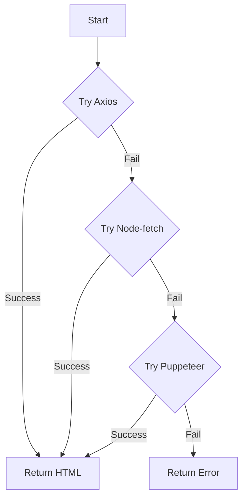

# Waterfall-Fetch

Waterfall-Fetch is a powerful and flexible utility for web scraping and HTML fetching, employing a cascading retry approach with multiple strategies. It's designed to provide a robust solution for retrieving HTML content from websites, even when faced with various challenges. But above all it is designed to be simple.

<CardGroup cols={2}>
	<Card title="Quick Start" icon="play" href="/mdx/quickstart">
		Get up and running with Waterfall-Fetch in minutes
	</Card>
	<Card title="API Reference" icon="code" href="/mdx/api-reference/gethtml">
		Explore the Waterfall-Fetch API
	</Card>
</CardGroup>

## Key Features

<AccordionGroup>
	<Accordion title="Multiple Fetching Strategies">Utilizes Axios, Node-fetch, and Puppeteer for optimal content retrieval</Accordion>
	<Accordion title="Waterfall Approach">Intelligently cascades through strategies to ensure successful fetching</Accordion>
	<Accordion title="Stealth Mode">Employs Puppeteer for JavaScript-heavy sites, enhancing scraping capabilities</Accordion>
	<Accordion title="Customizable Strategy Prioritization">Allows you to tailor the fetching process to your specific needs</Accordion>
	<Accordion title="Built-in Error Handling">Robust error management for reliable scraping operations</Accordion>
	<Accordion title="TypeScript Support">Fully typed for enhanced developer experience and code quality</Accordion>
</AccordionGroup>

## How Waterfall-Fetch Works

This diagram illustrates the cascading approach of Waterfall-Fetch:

1. It starts with the fastest method (Axios).
2. If that fails, it moves to Node-fetch.
3. If Node-fetch fails, it uses Puppeteer as a last resort.
4. If all methods fail, it returns an error.

This intelligent, tiered strategy ensures that you're always using the most appropriate and efficient method for each unique scraping scenario, balancing speed, cost, and accuracy.

Ready to dive in? Check out our [Quick Start](/mdx/quickstart) guide to begin your journey with Waterfall-Fetch!
